# How to decide which mobile framework to use

## Decision flowchart

```mermaid
---
config:
  theme: neutral
  look: classic
---
flowchart TD
    TargetOS["I target only one operating system"] -->|yes| Native["Native"]
    TargetOS -->|no| LimitedBudget["I have a very limited budget"]
    
    LimitedBudget -->|yes| CrossPlatformDependencies["Every dependency I will use has a cross platform implementation"]
    LimitedBudget -->|no| PerformanceTuning["I want to fine-tune my application performance"]
    
    PerformanceTuning -->|yes| CodebaseSharing["I am willing to learn an additional framework and complexify my codebase to share my domain and data layer"]
    PerformanceTuning -->|no| NativeAPIUsage["My application will use many native APIs"]
    
    CodebaseSharing -->|yes| DeveloperSkills["Developers are willing to work with Kotlin and Android Studio"]
    CodebaseSharing -->|no| Native
    
    DeveloperSkills -->|yes| UIFrameworkSharing["I am ready to use an additional beta framework to share at least part of my user interface between the targeted
operating systems"]
    DeveloperSkills -->|no| Native
    
    UIFrameworkSharing -->|yes| ComposeMultiplatform["Compose Multiplatform"]
    UIFrameworkSharing -->|no| KotlinMultiplatform["Kotlin Multiplatform"]
    
    NativeAPIUsage -->|yes| CodebaseSharing
    NativeAPIUsage -->|no| LibraryReliance["I am opposed to rely on community-maintained libraries"]
    
    LibraryReliance -->|yes| CodebaseSharing
    LibraryReliance -->|no| OSAPIImplementation["I want to implement new operating system APIs as quickly as possible"]
    
    OSAPIImplementation -->|yes| CodebaseSharing
    OSAPIImplementation -->|no| AppResponsiveness["Application responsiveness is a competitive advantage"]
    
    AppResponsiveness -->|yes| CodebaseSharing
    AppResponsiveness -->|no| ListComplexity["The application displays many nested non standard elements in lists"]
    
    ListComplexity -->|yes| CodebaseSharing
    ListComplexity -->|no| UserExperienceOptimization["I want an operating system optimized user experience"]
    
    UserExperienceOptimization -->|yes| CodebaseSharing
    UserExperienceOptimization -->|no| TerminalFleetManagement["I manage my terminal fleet"]
    
    TerminalFleetManagement -->|yes| TerminalSDKDependency["I depend on native software development kit provided by my terminals manufacturers"]
    TerminalFleetManagement -->|no| TechnicalStackMaintenance["I want to ensure my technical stack will be maintained for the longest possible time"]
    
    TerminalSDKDependency -->|yes| CodebaseSharing
    TerminalSDKDependency -->|no| TechnicalStackMaintenance
    
    TechnicalStackMaintenance -->|yes| CodebaseSharing
    TechnicalStackMaintenance -->|no| CrossPlatformDependencies
    
    CrossPlatformDependencies -->|yes| DesignCriticality["I want a dedicated UI engine that garantees a UI consistency across the targeted OS"]
    CrossPlatformDependencies -->|no| NativeLibrarySkills["I have skills to develop my own native libraries"]

    NativeLibrarySkills -->|yes| DesignCriticality
    NativeLibrarySkills -->|no| LibraryCriticality["The aforementioned libraries are critical for my application"]
    
    LibraryCriticality -->|yes| CodebaseSharing
    LibraryCriticality -->|no| DesignCriticality
    
    DesignCriticality -->|yes| Flutter["Flutter"]
    DesignCriticality -->|no| LanguagePreference["I absolutely want to work with a statically typed language that enforces type soundness"]
    
    LanguagePreference -->|yes| Flutter
    LanguagePreference -->|no| EcosystemCapitalization["I absolutely want to capitalize on the Javascript and React ecosystem already present in my company"]
    
    EcosystemCapitalization -->|yes| ReactNative["React Native"]
    EcosystemCapitalization -->|no| DependencyUpgradeAvoidance["I want to avoid investing time in upgrading dependency clusters"]
    
    DependencyUpgradeAvoidance -->|yes| Flutter
    DependencyUpgradeAvoidance -->|no| ApplicationBootstrapping["I absolutely want to use a ready to use tool to bootstrap my application"]
    
    ApplicationBootstrapping -->|yes| ReactNative
    ApplicationBootstrapping -->|no| LearningEase["I want the cross platform framework that is easiest to become familiar with"]
    
    LearningEase -->|yes| Flutter
    LearningEase -->|no| WebEcosystemPreference["I like the web ecosystem"]
    
    WebEcosystemPreference -->|yes| ReactNative
    WebEcosystemPreference -->|no| Flutter

    TargetOS@{ shape: circle}
    Native@{ shape: terminal}
    Flutter@{ shape: terminal}
    ReactNative@{ shape: terminal}
    KotlinMultiplatform@{ shape: terminal}
    ComposeMultiplatform@{ shape: terminal}

    TargetOS:::StartStep
    Native:::FinalStep
    Flutter:::FinalStep
    ReactNative:::FinalStep
    KotlinMultiplatform:::FinalStep
    ComposeMultiplatform:::FinalStep

    classDef StartStep stroke-width:2px, stroke-dasharray:none, stroke:#00C853, fill:#C8E6C9, color:#000000
    classDef FinalStep stroke-width:4px, stroke-dasharray:none, stroke:#FBB35A, fill:#FFEFDB, color:#8F632D

    linkStyle 0,2,4,6,8,10,12,14,16,18,20,22,24,26,28,30,32,34,36,38,40,42,44,46,48 stroke:#00C853
    linkStyle 1,3,5,7,9,11,13,15,17,19,21,23,25,27,29,31,33,35,37,39,41,43,45,47,49 stroke:#D50000
```

## Explanation

According to us, there are many keypoints that make crossplatform development risky.
We like native apps, and most of all we like that our clients can be autonomous when they develop.
We typically don't develop basic mobile apps without much complexity. We instead target mobile applications that may scale.

These apps require a well defined architecture and organization.
To us, we have to avoid many traps that are typically not shown when we begin mobile development :-)
